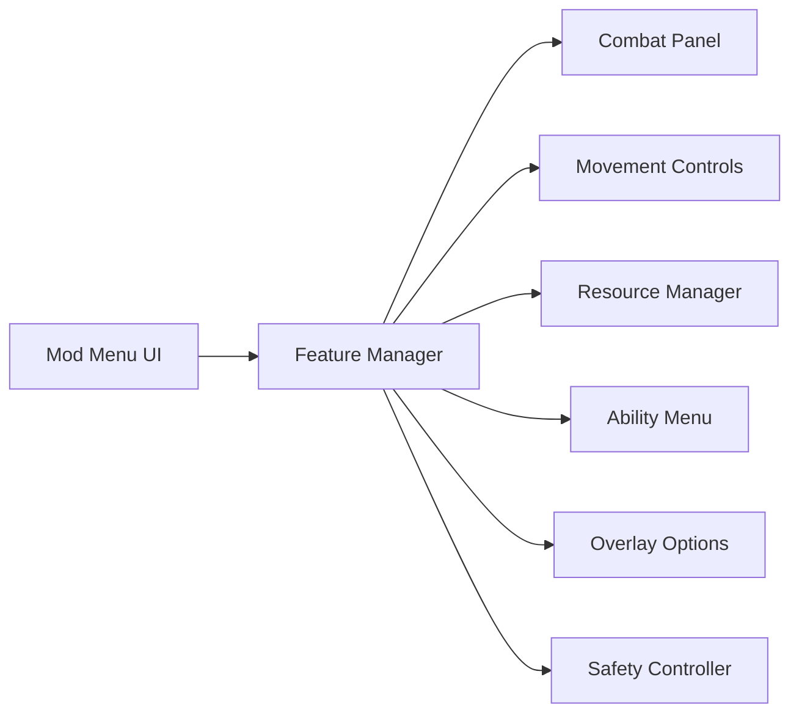

## Overview

Knight's Path Mod Menu is a modular runtime feature panel designed to centralize gameplay modifications within a single interactive interface. Operating as an external control layer, the menu aggregates combat adjustments, movement modifiers, resource regulation, and awareness tools into a unified toggle-based system. Each feature is managed independently through live state evaluation, allowing real-time activation and deactivation without restarting the session. Supporting systems handle configuration persistence, priority resolution, and safe state rollback, ensuring predictable behavior during gameplay.

## Centralized Feature Toggle Interface 🧩

* Category-based feature grouping
* Instant enable/disable switches
* Real-time state reflection
* Non-blocking UI rendering

**In-game behavior:**
Acts as the primary control surface, dispatching toggle states to underlying modules without interrupting the main game loop.

## Combat Adjustment Panel ⚔️

* Damage multiplier sliders
* Incoming damage reduction toggles
* Critical hit enforcement
* Conditional combat overrides

**Feature intent:**
Provides direct access to combat-related modifiers, applying changes dynamically at calculation time.

## Movement and Navigation Controls 🧭

* Speed and acceleration scaling
* Jump height and fall control
* Sprint and dodge tuning
* Gravity influence modifiers

**In-game behavior:**
Updates traversal-related parameters before physics resolution, ensuring smooth movement transitions.

## Resource Management Switchboard 🔋

* Health and stamina locks
* Mana consumption scaling
* Regeneration rate control
* Threshold-based stabilization

**Feature intent:**
Regulates resource flow by intercepting consumption and regeneration logic during runtime.

## Ability and Skill Menu ⏱️

* Cooldown freeze toggles
* Instant reset buttons
* Ability-specific rule sets
* Conditional timer handling

**In-game behavior:**
Manages skill timing states, allowing selective enforcement or bypass of cooldown logic.

## Awareness and Overlay Options 👁️

* Enemy and NPC highlighting
* Distance-based visibility filters
* Line-of-sight checks
* Adjustable refresh rates

**Feature intent:**
Displays contextual spatial information through an isolated overlay layer, configurable directly from the menu.

## Configuration and Preset Manager 📂

* Multiple saved presets
* Hot-switching during gameplay
* Version-safe storage
* Default fallback recovery

**In-game behavior:**
Maintains consistent menu behavior across sessions while allowing rapid profile changes.

## Safety and State Control Layer 🛡️

* Feature conflict prevention
* Priority-based override handling
* Automatic state release
* Clean shutdown routines

**Feature intent:**
Ensures stable operation when multiple menu features are active simultaneously.

## FAQ

**Is the mod menu always visible?**
No. The interface can be shown or hidden during gameplay.

**Can features be toggled independently?**
Yes. Each system operates independently through the menu.

**Do changes apply instantly?**
Yes. Most toggles apply changes in real time.

**Are presets saved between sessions?**
Yes. Presets persist locally unless manually removed.

**Can multiple presets be used in one session?**
Yes. Presets support hot-switching.

**Does the menu affect performance?**
UI and feature update rates are optimized and configurable.

## Feature Summary

* Centralized mod menu interface
* Combat adjustment controls
* Movement and navigation modifiers
* Resource management switches
* Ability and cooldown handling
* Awareness and overlay options
* Configuration presets and safety controls

---
